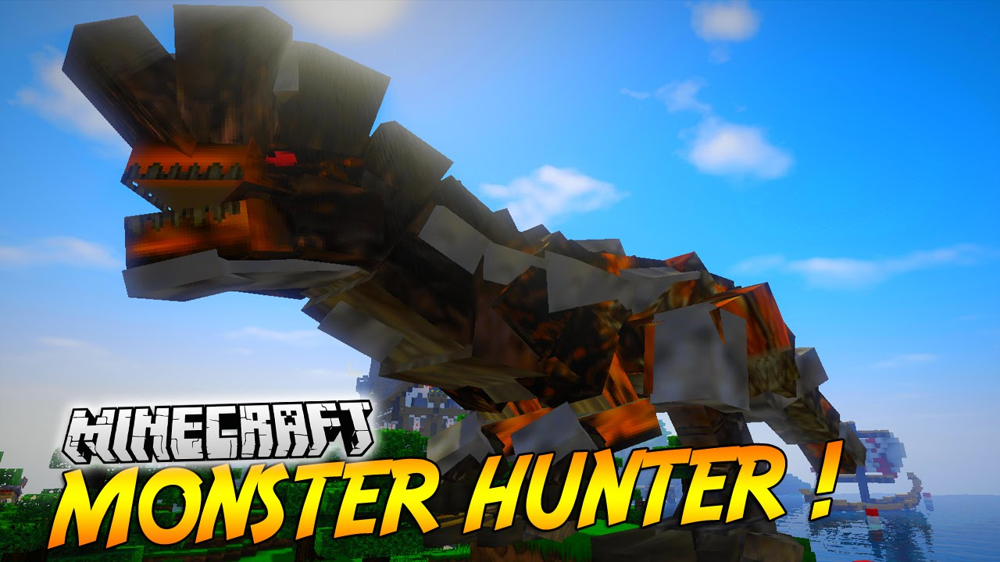

---
layout: default
title:  Final Report
---

## Video

## Project Summary
Our project design is to let an agent can learn how to kill a monster efficiently by Q-learning in a given environment. We set up a 40x40 battleground for an agent and a monster to fight each other. The agent will be given a special melee weapon at the beginning of the game, and the agent will attack the monster automatically whenever the monster is within the agent’s attack range. Every successful hit will grant the agent some reward, killing the monster will grant a large amount of reward so that the agent can learn from some sequences of actions. Also, if the agent gets hit or dies, the agent will be granted a negative reward respectively. Our goal is to let the agent make the best action while fighting the monster, such as moving to a certain place to doge attack or moving towards the monster and attack it. In this problem setup, AI/ML algorithm is needed. Since the monster is consistently making actions under some certain patterns. The AI/ML algorithms can let agent adapt to that pattern very quickly and output the best actions for the agent. 

The challenge for our design was defining the state for our agent. The Malmo only provided a few parameters of the monster, and those data were raw data. When fighting with the monster, our agent had a lot of factors to consider, we had to preprocess those raw data into some useful data, such as distance to the monster, facing direction, so the agent could learn how to dodge the attack easily. When taking all of those factors into the learning process, it becomes complicated.

## Approach
The algorithm we use is Q-learning. Q-learning can learn a policy that tells the agent which action can maximum the reward in a given state. The update function for Q-learning in time t is 
     
Q_new = (1-learning_rate) * Q_old + learning_rate * (reward + discount_factor * Q_optimal). 
{:height="35%" width="35%"}

In our project, we use Q-learning to update the Q-table, and then choose the best action from Q-table. If there are multiple actions give the same Q value, we will choose one of them randomly. Using Q-table, our agent will have an optimal policy to handle different circumstances. 

Another reason that we use Q-learning because we only have a few states. Our states are the combination of three features, distance between agent and monster, does the monster facing the agent and the speed of monster. The monster facing is a Boolean value, true if monster facing the agent, false otherwise. This feature let the agent to avoid let the monster facing us. For the distance parameter, we simplify the real distance into different categories, if the distance is less than three, define this circumstance into category one, if distance between three to six, we define this circumstance into category two, if distance between six to nine, it is category three, and so on. There are two reasons to simplify the distance. First, distance is a real number, if we directly use it as the state without any modify, the number of states will be very large and the agent may not go to the state again. Second, a little amount changing of distance does affect the agent, for example, the Q-value for 10 and 11 distance are almost the same. Therefore, we only have six states in total. The last feature is monster’s speed, this tells the agent that the monster is moving or not, if it is moving, then in the agent’s view, the monster might be attacking. This feature helps the agent learn when to dodge. 

The actions that agent has are move front, back, left, right. The attack and turn are hard coded in the function. Agent is always facing the monster and always attack. 

The reward function takes the agent health point and monster health point as input. If agent loss health point or die, it will deduct reward. If the monster loss health point, agent will get positive reward. When either agent or monster die, the mission will end. If no one get damage, reward will be -3, it encourages the agent to kill the monster as fast as possible.

## Evaluation
We use the monster total damage for the quantitative evaluation. The goal of our project is let the agent learns how to kill the monster, so if the agent does learn the policy of killing the monster, it will try to damage the monster as much as possible. Therefore, the damage for each trial is a good parameter to estimate how good the agent preforms. 

{:height="35%" width="35%"}

The health of monster is around 3500, so the agent does try to kill the monster. However, it is hard to kill the monster every time, for the monster is very active and power, if agent make a mistake, it will get a lot of damage. Around 20 to 30 episodes, there a valley. We think the problem is that the agent updates the policy in some special case, and it affects the original policy.

The score is a very important source to evaluate the agent how good they learn to kill the monster

{:height="35%" width="35%"}

The score and damage graph are similar, for the damage affect the score heavily. 

Our ultimate goal is let the agent to kill the monster as fast as possible. Therefore, run time is also important. 

{:height="35%" width="35%"}

Comparing the run time and the above two graphs, we can see that when the scores are low, the run time is also longer. If the agent requires a longer time, it usually in some new circumstances, so it takes some random action and wastes time. Because the agent does not know how to do, it is easily got kill be the monster and cause lower score.

    
    
## Reference
Reference code: 

UCI CS175 2019 spring assignment2

Reference article: 

https://medium.com/emergent-future/simple-reinforcement-learning-with-tensorflow-part-0-q-learning-with-tables-and-neural-networks-d195264329d0

https://medium.com/@m.alzantot/deep-reinforcement-learning-demysitifed-episode-2-policy-iteration-value-iteration-and-q-978f9e89ddaa

