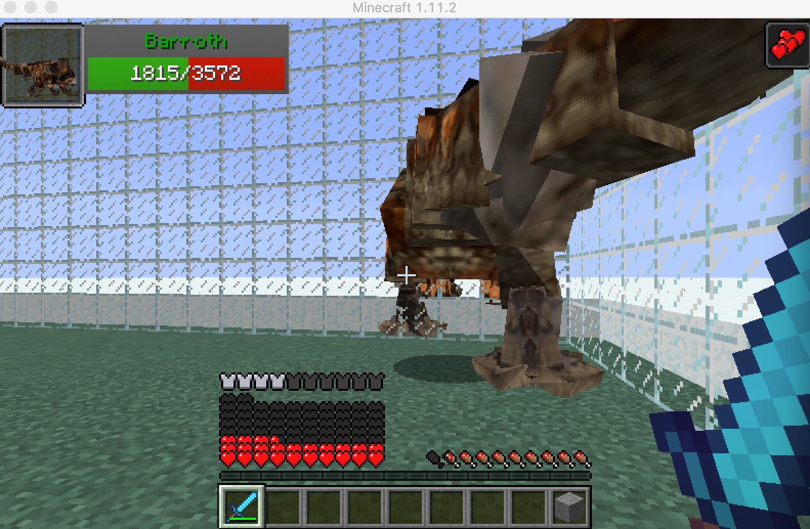
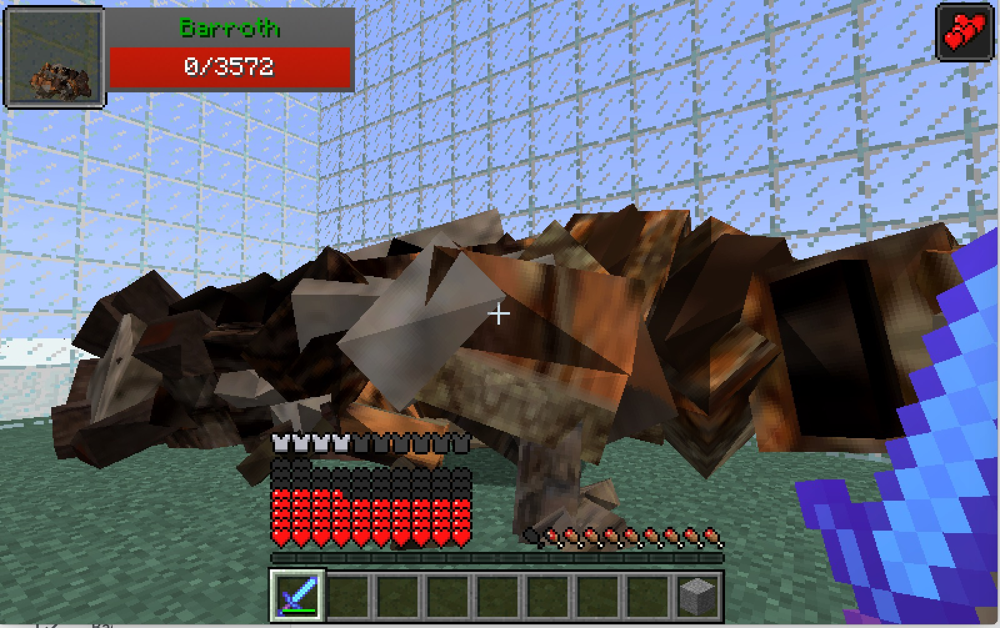

# Welcome to Monster_Hunter_Frontier AI Project!!

(picture from: http://www.9minecraft.net/monster-hunter-frontier-craft-mod/)

## Project Summary
  Our project design is based on a mod of Minecraft, monster hunter frontier, where an agent can learn how to kill a monster efficiently by q learning in that environment. We set up a 40x40 battleground for an agent and a monster to fight each other. The agent will be given a special melee weapon at the beginning of the game, and the agent will attack the monster automatically whenever the monster is within the agent’s attack range. The agent will be granted a certain amount of reward when successfully hitting the monster so that the agent can learn from some sequence of actions. Also, the agent will granted a negative reward when get hit by the monster to form better learning. Our goal is to let the agent make the best action while the monster is alive, such as moving to a certain place to doge attack or moving towards the monster and attack it.

## Progress Reports:

- [Proposal](proposal.html)
- [Status](status.html)
- [Final](final.html)

## Agent ScreenShots
 

### Source code:
[mh_setup.py](mh_setup.py)

[mh_helper.py](mh_helper.py)

